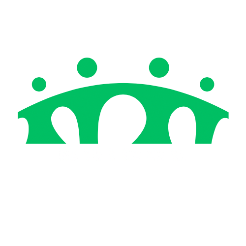

&nbsp;
&nbsp;
&nbsp;
&nbsp;
&nbsp;

&nbsp;
&nbsp;

<!-- Qui un giorno ci sarà la nostra roba e non quella di Heartcare, ma fino a che non abbiamo un CI/CD non si può--->

## Introduzione
La seguente repository contiene tutti gli artefatti relativi al progetto combinato tra studenti triennali e magistrali svolto nell'Anno Accademico 2024/25 dell'<a href="https://www.unisa.it">**Università degli Studi di Salerno**</a>.

## Ambito del progetto
**Bridge** è una piattaforma digitale progettata per favorire l’integrazione sociale ed economica di rifugiati e migranti in Italia. Offre strumenti per la gestione di alloggi, corsi di formazione, annunci di lavoro e consulenze, supportati da un chatbot multilingue e una live chat. Utilizza l’**intelligenza artificiale** per ottimizzare l’assegnazione degli alloggi e suggerire il lavoro più adatto ai rifugiati, basandosi sulle loro competenze e preferenze.

## Autori

- **Leopoldo Todisco**        - *Project Manager*   - [Github](https://github.com/leotodisco)

- **Carlo Venditto**          - *Project Manager*   - [Github](https://github.com/carlovend)

- **Alessia De Filippo**        - *Sviluppatore*      - [Github](https://github.com/al3ssiaDeFilippo)

- **Antonio Ceruso**      - *Sviluppatore*      - [Github](https://github.com/PureLoop)

- **Benedetta Colella**   - *Sviluppatore*      - [Github](https://github.com/miskassi)

- **Biagio Gallo**          - *Sviluppatore*      - [Github](https://github.com/Biagista)

- **Geraldine Montella**          - *Sviluppatore*      - [Github](https://github.com/GuardianMont)

- **Mario Zurolo**  - *Sviluppatore*      - [Github](https://github.com/MarioZurolo)
  
- **Vito Vernellati**  - *Sviluppatore*      - [Github](https://github.com/Vito-03)
